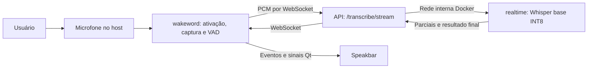

# Histórico de evolução do J.A.R.V.I.S.

Documento atualizado em **19 de setembro de 2026**.

Este registro descreve as mudanças realizadas durante a jornada de construção da speakbar e integração do reconhecimento de voz. Foi elaborado com base nas decisões da conversa, nas validações registradas durante a implementação e no código presente no projeto nesta data.

O projeto evoluiu de uma interface demonstrativa e uma captura de áudio com duração fixa para uma interface conectada à transcrição local, com resultados parciais durante a fala. As seções 1–11 registram essa etapa anterior. A seção 12 registra a integração posterior da IA local, confirmação por voz e primeiras ações no Windows.

## 1. Ponto de partida e objetivo

O objetivo apresentado em [ResumoArquitetura.md](ResumoArquitetura.md) é construir um agente de acessibilidade para pessoas com dificuldades motoras. O sistema deverá compreender comandos falados e, posteriormente, realizar ações como abrir aplicativos, pesquisar, digitar e interagir com a tela.

Esse documento de arquitetura descreve a visão do produto e seu planejamento. Componentes como interpretação por LLM, confirmação por voz, percepção de tela e executor de ações não devem ser confundidos com funcionalidades já entregues nesta jornada.

O trabalho realizado concentrou-se em três necessidades:

- Criar uma interface flutuante para a interação com o usuário.
- Conectar essa interface ao microfone, à wake word e à transcrição real.
- Reduzir a espera pelo texto, apresentando hipóteses enquanto o usuário fala.

A divisão entre `wakeword`, `api`, `worker` e `speakbar` foi preservada ao longo dessas mudanças.

## 2. Construção da speakbar

### Interface baseada no protótipo

Foi criado o pacote [speakbar](speakbar/), utilizando Python e PySide6. A aparência segue o protótipo apresentado no Figma:

- Cápsula com largura aproximada de 692 pixels lógicos e altura inicial de 60 pixels.
- Fundo cinza translúcido, acabamento em gradiente e borda clara.
- Botão circular com ondas à esquerda e botão de fechar à direita.
- Texto central somente para leitura.
- Janela sem moldura e acima das janelas comuns.
- Posicionamento inicial centralizado, próximo à parte inferior da área útil do monitor principal.
- Arraste pela região central, com ajuste aos limites da área útil dos monitores.

Os ícones são desenhados pelo próprio Qt. Não foram adicionadas imagens externas nem desfoque nativo do sistema operacional.

### Demonstração inicial

A primeira experiência foi organizada como um ciclo demonstrativo, independente de microfone, modelos e Docker:

| Etapa | Mensagem | Duração |
| --- | --- | --- |
| Repouso | Olá, Como posso ajudar? | Até a ativação |
| Escuta simulada | Demonstração: ouvindo… | 3 segundos |
| Processamento simulado | Demonstração: processando… | 2 segundos |
| Resultado simulado | Demonstração concluída | 3 segundos |

Um novo clique cancela o ciclo. Essa demonstração foi preservada e passou a ser acessada explicitamente por `--demo`, enquanto o modo padrão utiliza o reconhecimento real.

### Alteração no comportamento de fechar

A proposta inicial previa recolher a janela para a bandeja. Depois, foi solicitado que fechar significasse encerrar completamente o aplicativo.

O comportamento final de **X, Alt+F4 e “Sair”** é solicitar o encerramento. Na integração real, isso inclui cancelar a interação, liberar o microfone e aguardar o término cooperativo das threads. A interface continua respondendo durante essa finalização.

O ícone de bandeja mantém ações como “Mostrar barra” e “Sair”, mas o X não deixa o aplicativo executando minimizado.

### Acessibilidade e apresentação do texto

Foram incluídos nomes acessíveis, dicas nos botões, foco visível, navegação por Tab e ativação dos botões por Enter/Espaço.

Com a integração da transcrição, a área de texto passou a permitir:

- Expansão da cápsula para até três linhas, mantendo a borda inferior ancorada.
- Rolagem vertical por mouse e teclado para textos maiores.
- Exibição de texto simples, somente para leitura.
- Permanência do resultado final até a próxima interação.
- Animação das ondas durante a captura do comando.

Arquivos principais: [speakbar/window.py](speakbar/window.py), [speakbar/controller.py](speakbar/controller.py) e [speakbar/__main__.py](speakbar/__main__.py).

## 3. Adequação da wake word e carregamento dos modelos

Durante o uso do openWakeWord, ocorreu uma falha relacionada à ausência do `tflite-runtime`. A inferência da wake word foi organizada para utilizar **ONNX Runtime em CPU**, em vez de depender de TFLite.

O carregamento foi centralizado em [wakeword/model_loader.py](wakeword/model_loader.py), com:

- Seleção explícita do backend ONNX.
- Carregamento dos modelos `hey_jarvis`, `melspectrogram` e `embedding_model`.
- Supressão Speex desativada nessa integração, para evitar uma dependência não portátil entre os sistemas pretendidos.
- Download dos modelos oficiais para um cache local.
- Verificação de cancelamento durante o download e descarte de arquivos incompletos.
- Possibilidade de alterar o diretório de cache por `WAKEWORD_MODELS_DIR`.

Posteriormente, o mesmo carregador recebeu o **Silero VAD em ONNX**, usado para detectar fala e silêncio durante os comandos.

O comando abaixo prepara e carrega os modelos da wake word e do VAD sem abrir o microfone:

```bash
python -m wakeword.model_loader
```

A orientação de instalação documentada adotou Python 3.11 de 64 bits como base comum, especialmente no Linux devido às dependências transitivas do openWakeWord. A execução local desta jornada utilizou Windows com Python 3.12. A intenção de compatibilidade com Linux/macOS não equivale a uma validação nativa já concluída nesses sistemas.

## 4. Integração da transcrição por arquivo à interface

Antes das parciais, foi implementado um fluxo real baseado em gravação e processamento posterior:

```text
Ativação por voz ou botão
        ↓
Captura por RECORD_SECONDS, com padrão de 5 segundos
        ↓
Arquivo WAV em recordings/
        ↓
POST /transcribe/upload
        ↓
Tarefa Celery e reconhecimento pelo Whisper
        ↓
GET /transcribe/{task_id}/status
        ↓
Texto final na speakbar
```

O cliente dessa etapa foi organizado em [wakeword/transcription_client.py](wakeword/transcription_client.py). Ele envia o arquivo, consulta o estado da tarefa a cada 500 ms e aplica um limite total de 120 segundos para o fluxo de transcrição.

Os textos dos segmentos retornados são concatenados na ordem recebida, com remoção de espaços excedentes. O resultado deixa de ser apenas uma saída no terminal e passa a alimentar a interface.

### Separação entre serviço de voz e interface

O serviço de voz passou a emitir eventos de estado, texto e identificação da interação, definidos em [wakeword/events.py](wakeword/events.py). O pacote `wakeword` permanece independente de Qt.

O controlador da speakbar executa o serviço em uma `QThread` e recebe as atualizações por sinais. Carregamento dos modelos, captura de áudio e comunicação com o backend ficam fora da thread gráfica.

Também foram introduzidos ou consolidados:

- Ativação por “hey jarvis” e pelo botão de ondas.
- Uma interação por vez.
- Cancelamento pelo mesmo botão durante captura ou processamento.
- Identificação das interações para descartar respostas atrasadas.
- Um único proprietário do microfone.
- Fechamento do stream durante a espera pelo resultado e reabertura ao retomar a escuta.
- Mensagens de falha e possibilidade de nova tentativa.

### Ajuste na resposta de erro da API

O GET de consulta foi ajustado para não devolver diretamente uma exceção do Celery. Em estados `FAILURE` ou `REVOKED`, retorna `result: null` e um campo `error` textual serializável, preservando a estrutura de sucesso.

Essa alteração está em [api/controller.py](api/controller.py).

### Dificuldades de execução esclarecidas

Dois problemas identificados durante essa etapa eram relacionados ao ambiente ou ao endereço utilizado:

- O erro de conexão ao pipe `dockerDesktopLinuxEngine` indicava indisponibilidade do mecanismo Docker esperado pelo comando Compose.
- A URL `http://localhost:8000trasncribe/{task_id}/status` estava malformada: faltava a barra após a porta, havia erro em `transcribe` e o identificador precisava ser substituído pelo valor real da tarefa.

A rota correta é `http://localhost:8000/transcribe/IDENTIFICADOR_DA_TAREFA/status`. Esses esclarecimentos não constituem mudanças no modelo de reconhecimento.

## 5. Transição para transcrição parcial em tempo real

### Motivação

No fluxo de arquivo, o usuário precisava aguardar a gravação completa e o processamento para ver qualquer texto. A mudança principal desta jornada foi permitir feedback durante a fala.

O streaming tornou-se o padrão. O fluxo anterior continua disponível com `TRANSCRIPTION_MODE=batch`.

### Arquitetura atual



O microfone permanece no host. A inferência do Whisper ocorre localmente, em um container Docker, sem enviar o áudio para uma API externa de reconhecimento. Os downloads iniciais de modelos exigem acesso às suas fontes; depois, os caches são reutilizados.

### O significado de “tempo real” nesta implementação

O Whisper produz hipóteses sucessivas a partir do áudio acumulado da interação. Ele não recebe uma palavra isolada para acrescentá-la definitivamente ao texto.

Após aproximadamente um segundo de áudio enviado, o serviço pode iniciar a primeira inferência. A cada segundo adicional, solicita uma nova hipótese conforme a capacidade de processamento.

Cada parcial contém **o texto completo reconhecido até aquele momento** e substitui a anterior. O resultado final substitui a última parcial. Isso permite corrigir palavras quando mais contexto fica disponível e evita duplicar trechos na interface.

Exemplo ilustrativo de evolução:

```text
Parcial 1: Abra o navegador
Parcial 2: Abra o navegador e pesquise vídeos
Final:    Abra o navegador e pesquise vídeos no YouTube.
```

As parciais podem conter palavras incorretas e sofrer revisões. Uma parcial interrompida por erro ou cancelamento não é apresentada como resultado final.

### Captura e detecção do fim da fala

O host captura PCM de 16 bits, mono, a 16 kHz, em blocos de aproximadamente 80 ms. O Silero VAD analisa esses blocos para identificar voz e silêncio, com estado reiniciado entre comandos.

O silêncio inicial não é enviado ao Whisper. Um pequeno buffer anterior à confirmação de voz, de até 240 ms, ajuda a preservar o início das palavras.

| Condição | Comportamento padrão |
| --- | --- |
| Voz detectada | Envia o áudio e recebe parciais simultaneamente. |
| Pausa de aproximadamente 2 segundos após detectar voz | Encerra a captura e solicita a transcrição final. |
| Nenhuma voz durante 10 segundos | Informa ausência de fala e retoma a escuta da wake word. |
| Interação atinge 30 segundos | Finaliza a captura no limite de duração. |

O áudio do streaming fica somente em memória. Esse caminho não cria WAVs em `recordings/` nem arquivos de upload no servidor. O comportamento de gravação permanece no modo batch, e os arquivos anteriores não foram removidos pela implementação do streaming.

### Novo serviço de reconhecimento

Foi acrescentado o container `realtime`, com código dentro de `worker`, mas em processo separado do Celery.

| Configuração | Valor adotado para streaming |
| --- | --- |
| Implementação | faster-whisper |
| Modelo | `base` |
| Dispositivo | CPU |
| Tipo de cálculo | `int8` |
| Threads de CPU | 4 |
| Workers do modelo | 1 |
| Idioma | Português (`pt`) |
| `beam_size` | 1 |
| Temperatura | 0 |

O modelo é carregado uma vez e aquecido antes de aceitar conexões. O cache é compartilhado pelo volume `whisper-cache`.

Durante a preparação, uma limitação de requisições à listagem remota dos arquivos do modelo motivou o uso de uma revisão fixa do repositório oficial. O carregador busca os arquivos necessários individualmente e verifica primeiro o cache local, evitando repetir a consulta à listagem a cada inicialização.

O serviço atende uma conexão de reconhecimento por vez. Sua porta 8001 é acessada pela rede interna do Docker; a entrada pública do aplicativo continua sendo a API na porta 8000.

### Controle de carga e resultados obsoletos

O agendador mantém uma inferência em andamento e o áudio acumulado mais recente como trabalho pendente. Se o processamento estiver lento, não cria uma fila crescente de hipóteses antigas.

Quando chega `finish`, a versão completa do áudio tem prioridade sobre uma hipótese incompleta pendente. Ao cancelar, o resultado é invalidado; uma inferência de CPU já iniciada pode terminar, mas sua resposta é descartada antes de liberar a capacidade para outra interação.

O cliente também limita a fila de envio a 32 blocos, aproximadamente 2,5 segundos de áudio. Atrasos excessivos geram uma falha recuperável em vez de crescimento indefinido dessa fila.

### Protocolo e recuperação

O WebSocket utiliza mensagens de controle `start`, `finish` e `cancel`, além dos blocos binários de áudio. As respostas são `ready`, `partial`, `final` e `error`.

Parciais e resultados finais carregam identificação da interação, sequência crescente e texto completo. O cliente ignora respostas de outra interação e sequências repetidas ou antigas.

Foram aplicados limites de espera, incluindo conexão de 3 segundos, envio de 2 segundos, até 15 segundos sem uma nova resposta durante captura com fala e até 20 segundos para o resultado após `finish`.

Falhas de áudio, modelos ou conexão oferecem nova tentativa pelo botão. O texto recebido como parcial não é convertido em sucesso quando o resultado final não chega.

## 6. Arquivos e responsabilidades

| Arquivo ou pasta | Papel na evolução |
| --- | --- |
| [main.py](main.py) | Entrada comum para interface, demonstração e terminal. |
| [speakbar/window.py](speakbar/window.py) | Aparência, texto, acessibilidade, arraste e encerramento da janela. |
| [speakbar/controller.py](speakbar/controller.py) | Controladores real e demonstrativo; adaptação dos eventos para Qt. |
| [wakeword/detect_microphone_service.py](wakeword/detect_microphone_service.py) | Serviço de voz, posse do microfone, ativação e seleção entre batch e streaming. |
| [wakeword/model_loader.py](wakeword/model_loader.py) | Download e carregamento dos modelos ONNX e do VAD. |
| [wakeword/events.py](wakeword/events.py) | Contrato de eventos, estados e cancelamento, sem dependência de Qt. |
| [wakeword/transcription_client.py](wakeword/transcription_client.py) | Upload e consulta de tarefas no fluxo batch. |
| [wakeword/streaming_client.py](wakeword/streaming_client.py) | Transporte WebSocket, envio de áudio e recepção simultânea dos textos. |
| [wakeword/streaming_service.py](wakeword/streaming_service.py) | Coordenação da captura, VAD, parciais, finalização e recuperação. |
| [wakeword/speech_gate.py](wakeword/speech_gate.py) | Regras de silêncio, espera inicial e duração máxima. |
| [api/controller.py](api/controller.py) | Endpoints existentes, resposta de erro serializável e inclusão da rota de streaming. |
| [api/streaming.py](api/streaming.py) | Encaminhamento bidirecional entre host e serviço `realtime`. |
| [worker/realtime.py](worker/realtime.py) | Carregamento do Whisper e servidor de reconhecimento por WebSocket. |
| [worker/streaming_engine.py](worker/streaming_engine.py) | Buffer em memória, agendamento das hipóteses e descarte de resultados cancelados. |
| [worker/task.py](worker/task.py) | Processamento Celery anterior, preservado no fluxo batch. |
| [docker-compose.yml](docker-compose.yml) | Inclusão do `realtime` junto aos serviços existentes. |
| [requirements.txt](requirements.txt) | Referência às dependências de `wakeword` e `speakbar` para instalação no host. |
| [README.md](README.md) | Instalação, modos de execução, controles e configuração. |

Os Dockerfiles foram ajustados para copiar os novos módulos Python. As dependências receberam os componentes de WebSocket no host e na API e o servidor FastAPI/Uvicorn no ambiente do worker utilizado pelo `realtime`.

## 7. Compatibilidade com o fluxo anterior

A inclusão do streaming não substituiu o processamento Celery dos uploads. Os dois caminhos coexistem:

| Aspecto | Streaming padrão | Batch preservado |
| --- | --- | --- |
| Ativação | Voz ou botão | Voz ou botão |
| Fim da captura | Silêncio ou limite de duração | `RECORD_SECONDS` |
| Armazenamento do comando | Memória | WAV em disco |
| Transporte | WebSocket | Upload HTTP e consulta de tarefa |
| Reconhecimento | Container `realtime` | Worker Celery |
| Modelo atual | Whisper `base`, INT8 | Whisper `small`, float32 |
| Feedback | Parciais e resultado final | Resultado após o processamento |

Os endpoints de upload e consulta, Redis, beat, o volume de uploads e a política de retenção do backend batch foram preservados durante a mudança para streaming.

## 8. Modos de uso e configuração entregues

Com as dependências instaladas e o ambiente virtual ativado:

```bash
python main.py
python -m speakbar
python main.py --headless
python main.py --demo
python -m speakbar --demo
```

As duas primeiras opções abrem a interface integrada; `--headless` executa pelo terminal; `--demo` mantém a simulação visual sem microfone ou API.

| Variável | Padrão | Finalidade |
| --- | --- | --- |
| `TRANSCRIPTION_MODE` | `stream` | Seleciona `stream` ou `batch`. |
| `STREAM_SILENCE_SECONDS` | `2` | Silêncio após voz necessário para encerrar o comando. |
| `STREAM_START_TIMEOUT_SECONDS` | `10` | Espera máxima pela primeira fala. |
| `STREAM_MAX_SECONDS` | `30` | Limite total da interação, incluindo a espera inicial. |
| `API_URL` | `http://localhost:8000` | Endereço da API; também serve de base para a URL WebSocket. |
| `RECORD_SECONDS` | `5` | Duração da gravação no modo batch. |
| `DETECTION_THRESHOLD` | `0.3` | Limiar da wake word. |
| `WAKEWORD_MODELS_DIR` | Cache na pasta do usuário | Diretório dos modelos ONNX. |

Os três tempos de streaming aceitam valores positivos até 30 segundos. Pausas maiores podem ser acomodadas aumentando `STREAM_SILENCE_SECONDS`, dentro do limite total da interação.

## 9. Validações registradas durante a implementação

Esta seção registra verificações realizadas anteriormente; não representa uma nova execução de testes em 18/09/2026.

### Testes automatizados

Antes da limpeza solicitada posteriormente, passaram 16 testes de streaming, cobrindo:

- Revisão, ordenação e substituição das parciais.
- Distinção entre parcial e resultado final.
- Cancelamento durante preparação, captura e espera pelo resultado.
- Descarte de respostas atrasadas ou de outra interação.
- Desconexão e timeout sem transformar uma parcial em resultado final.
- Silêncio inicial, pausas curtas e limite de 30 segundos.
- Retomada da wake word após uma interação sem fala.
- Posse e liberação do microfone, sem chamar o gravador batch no streaming.
- Backend lento com retenção apenas do áudio mais recente pendente.

No cenário simulado de processamento lento, 113 blocos produziram somente duas inferências: a que já estava em andamento e a versão final mais recente.

### Medições com Docker e áudio PT-BR

As medições registradas em 16/09/2026 utilizaram Windows, Python 3.12, Docker Desktop, Intel Core i5-9400F e 16 GB de RAM. O Whisper estava aquecido e executou em CPU com quatro threads.

Foram usadas três frases sintéticas em português, geradas com a voz Microsoft Maria e reproduzidas em blocos à velocidade da fala pelo mesmo VAD e transporte do aplicativo.

| Comando | Duração do áudio | Primeira parcial | Final após início | Final após fim do arquivo |
| --- | ---: | ---: | ---: | ---: |
| Pesquisa no YouTube | 14,620 s | 2,140 s | 18,625 s | 4,005 s |
| Mensagem no bloco de notas | 11,834 s | 1,938 s | 15,328 s | 3,495 s |
| Pesquisa de reconhecimento de voz | 15,116 s | 2,046 s | 18,796 s | 3,680 s |

A mediana da primeira parcial foi **2,046 segundos**, atendendo à meta inicial de até 3 segundos nessas amostras. Todos os comandos receberam atualizações antes do término do áudio. O tempo até o resultado final inclui o silêncio de encerramento e o processamento restante.

Essas medições não comprovam o mesmo desempenho para qualquer computador ou usuário. Também não constituem um estudo de acurácia: em uma das frases, o modelo confundiu “acessibilidade” com “sensibilidade”.

### Interface, microfone e indisponibilidade do backend

No teste completo da interface com o comando do bloco de notas, a speakbar exibiu 10 parciais e o resultado final correspondente. Um temporizador Qt configurado para 20 ms teve intervalo máximo observado de aproximadamente 62 ms, indicando que a interface continuou respondendo durante aquele teste.

Também foram registrados:

- Expansão, ancoragem inferior, rolagem, foco, Enter/Espaço e limites da tela nas escalas de 100%, 125% e 150%.
- Captura de 16 blocos pelo microfone físico e liberação do stream e da conexão pelo X.
- Ausência de novos arquivos em `recordings/` nos testes de streaming.
- Mensagem de indisponibilidade ao parar o `realtime`, enquanto a consulta REST permaneceu acessível.
- Reinicialização do serviço após essa verificação.

O teste do microfone físico confirmou captura e encerramento, mas não mediu a qualidade de transcrição de uma pessoa falando ao vivo. A validação nativa em Linux e macOS também permanece pendente; executar o backend em container Linux no Windows não substitui esses testes.

## 10. Limpeza dos materiais de teste

Após a implementação, foi solicitada a remoção dos arquivos e pastas utilizados para testes. Foram removidos os arquivos-fonte de teste e o script `benchmark_streaming.py`, além das instruções de execução desses materiais na documentação.

Naquela operação, a exclusão de resíduos compilados `.pyc` foi bloqueada pela revisão automática, e isso foi informado. Na inspeção atual de 18/09/2026, as pastas `tests/`, `scripts/` e `docs/` já não estão presentes na raiz do projeto. Este registro não atribui à operação anterior as exclusões posteriores.

Os resultados desta seção são, portanto, evidências históricas da implementação. Os testes e o benchmark mencionados não estão disponíveis para execução no estado atual do repositório.

## 11. Estado entregue antes da integração da IA local

O aplicativo atualmente permite ativar a captura por voz ou botão, acompanhar hipóteses durante a fala, receber o texto final após a pausa e cancelar ou encerrar de maneira cooperativa.

Ainda não foram implementados nesta jornada:

- Interpretação dos comandos por LLM ou integração com Claude/Ollama.
- Execução de ações no sistema operacional, como abrir aplicativos, clicar ou digitar.
- Leitura da árvore de acessibilidade da tela para orientar ações.
- Confirmação por voz e síntese de fala para respostas ao usuário.
- Parada de emergência por voz para um executor de ações.
- Instalador, inicialização automática e persistência da posição da speakbar.
- Validação completa da operação exclusivamente por voz com usuários reais.

A transcrição entregue fornece o texto e o feedback visual necessários para a próxima etapa de interpretação e execução, mantendo separados os componentes de captura, transporte, reconhecimento e apresentação.

## 12. IA local, confirmação e primeiras ações — 18/09/2026

### Decisões implementadas

Foi antecipada a IA local antes planejada para uma fase futura. O Ollama roda no Docker
com `qwen3:4b-instruct` Q4_K_M, contexto de 4096 tokens, temperatura zero e saída
estruturada. A imagem validada é `ollama/ollama:0.34.2`, com funções de nuvem desabilitadas.
O volume `ollama-models` preserva o download. Uma configuração Compose adicional
habilita NVIDIA; a configuração base mantém execução em CPU disponível.

A API recebeu `POST /commands/interpret` e `GET /commands/health`. A interpretação
não passa pelo Celery. Os contratos Pydantic e a política de validação são compartilhados
com o host. Uma saída estruturada plana do modelo é convertida para ações tipadas:
abrir aplicativo, abrir URL e pesquisar no Google/YouTube. Respostas inválidas ou
endereços inventados são bloqueados; solicitações incompletas podem pedir esclarecimento.

O novo pacote `host_agent` concentra sessão, confirmação e execução no Windows,
independentemente de Qt. A confirmação falada usa SAPI e a voz PT-BR instalada.
O texto da pergunta deriva da ação validada; somente uma resposta final explícita
autoriza o despacho, uma vez por interação. Há uma repetição para confirmação
inconclusiva e no máximo um esclarecimento do pedido.

O executor resolve um catálogo de Chrome, Edge, Explorer e Bloco de Notas no host;
não recebe comandos de shell nem caminhos de executáveis produzidos pela IA.
Navegador padrão Chrome/Edge tem prioridade, seguido de Edge/Chrome como fallback.
Pesquisas usam URLs codificadas. A mensagem de sucesso indica despacho ao Windows,
sem afirmar que o site terminou de carregar.

### Microfone contínuo e interrupção

Uma thread mantém a propriedade exclusiva do microfone e distribui PCM em filas
limitadas. Rede, interpretação e TTS ficam fora dessa thread. O Vosk português pequeno
detecta frases finais isoladas de interrupção durante a interação, inclusive enquanto
a IA processa ou SAPI fala. Pedidos e confirmações continuam com Whisper.

O modelo português Vosk 0.3 utiliza `final.mdl` na raiz do diretório, um layout antigo
que o carregador passou a reconhecer. A pronúncia sintética de “parar” foi transcrita
pelo Vosk como “para”; essa forma isolada também foi incluída no detector.

A próxima conexão de confirmação é preparada antes da pergunta. Confirmações são
descartadas durante o TTS e os buffers reiniciados após uma cauda acústica de 300 ms.
O cancelamento invalida respostas pendentes e impede despachos futuros; não desfaz
aberturas já entregues ao Windows. Falhas no detector ou no TTS desabilitam ações,
preservando a transcrição.

`COMMANDS_ENABLED=0`, `--demo` e o modo batch foram preservados. Estados de interpretação,
fala, confirmação e execução foram acrescentados à speakbar. O modo terminal usa o
mesmo coordenador. Em sistemas diferentes do Windows, permanece somente transcrição.

### Validações automatizadas e ambiente real

Foram mantidos **48 testes automatizados** no estado final, incluindo os ajustes de
19/09, todos aprovados, cobrindo contratos, URLs,
catálogo/argumentos de execução, confirmação final, negação, silêncio, esclarecimento,
interrupção nas etapas da interação, repetição de despacho, respostas atrasadas,
indisponibilidade do backend, falha do detector, filas de áudio, propriedade do microfone,
cache Vosk, preparação da confirmação e gravação batch. Houve dois avisos de depreciação
nas dependências de teste Starlette/httpx/AnyIO, sem falhas.

As configurações Compose CPU/GPU foram validadas e `git diff --check` não encontrou
erros de whitespace. O Docker executou a inferência na **GTX 1060 de 6 GB**, com
`ollama ps` indicando **100% GPU**, contexto 4096 e cerca de **3,2 GB** para o modelo
carregado. A execução em CPU está configurada, mas seu desempenho não foi medido.

Seis cenários usaram áudio sintético Microsoft Maria PT-BR, PCM reproduzido à velocidade
da fala, Whisper real, Ollama real, confirmação falada SAPI, resposta sintética “sim”
reconhecida pelo Whisper e despacho real ao Windows:

| Pedido | STT inicial | Interpretação no backend | Ciclo até despacho |
| --- | ---: | ---: | ---: |
| Abrir Bloco de Notas | 5,235 s | 1,302 s | 16,485 s |
| Abrir Explorer | 5,906 s | 1,014 s | 17,109 s |
| Abrir navegador | 4,797 s | 1,118 s | 15,266 s |
| Abrir YouTube | 4,656 s | 1,073 s | 21,828 s |
| Pesquisar acessibilidade no Google | 6,250 s | 1,326 s | 20,031 s |
| Pesquisar receitas de pão no YouTube | 5,985 s | 1,243 s | 19,735 s |

Todos terminaram com um único despacho da ação esperada. A interpretação aquecida
teve mediana de aproximadamente **1,181 s**. O tempo total inclui o áudio inicial,
pausas, transcrição, pergunta falada e áudio/transcrição da confirmação; não representa
apenas o tempo de inferência. Esses números são amostras locais, não metas garantidas.

No detector, “parar”, “cancelar” e “parar agora” foram reconhecidos cerca de **448 ms,
494 ms e 662 ms**, respectivamente, após o fim dos WAVs sintéticos, medidos na linha
de tempo do áudio. “Pesquise como parar de fumar” e uma pergunta TTS contendo
“cancelar” não acionaram interrupção nessas amostras.

Também foram verificados:

- Captura de 12 blocos no microfone físico (30.720 bytes) e término de sua thread.
- Cancelamento de SAPI: sinal solicitado em 300 ms e retorno observado em 406 ms;
  a thread de fala terminou após o fechamento.
- Qt em modo offscreen com serviço real: preparação, ativação, captura, cancelamento
  e encerramento; timer de 20 ms teve intervalo máximo observado de 79 ms e a thread
  de voz terminou corretamente.

O script `scripts/validate_voice_commands.py` permite repetir a validação sintética;
`--dispatch` habilita aberturas reais. Os testes comuns não abrem aplicativos.

### Limites desta validação e próximos passos

Áudio sintético não comprova reconhecimento da fala de pessoas com deficiência motora.
O microfone físico foi validado separadamente; interrupção com fala humana sobreposta
ao alto-falante, acústica/eco e precisão em ambientes ruidosos precisam de validação
com usuários. O detector permanece ativo durante TTS, mas não há cancelamento acústico
de eco nem garantia de tempo real rígido.

Continuam adiados digitação, cliques, rolagem, fechamento de janelas, UI Automation,
visão computacional, sequências gerais, memória persistente e nuvem.

Durante o ajuste do carregador Vosk foi criada uma cópia aninhada de cache. A revisão
automática bloqueou a sua limpeza; ela foi preservada e não é utilizada pelo carregador.

## 13. Retomada e conclusão do contexto de esclarecimento — 19/09/2026

Após a interrupção da sessão, o Docker Desktop foi reiniciado e a implementação
existente foi preservada. O esclarecimento passou a ser enviado ao Ollama como
diálogo: pedido original, pergunta do assistente e resposta do usuário. Isso corrigiu
o caso em que o modelo repetia uma pergunta já respondida ao receber todos esses
campos em um único objeto de contexto.

Na validação direta com o modelo real, “pesquise no YouTube” seguido de “receitas de
pão” produziu pesquisa no YouTube. Um pedido de site seguido de `example.com` produziu
abertura de `https://example.com`. Os contratos públicos permaneceram iguais.

Foram consolidadas guardas para duas aberturas na mesma frase e pesquisas sem assunto.
Os endereços literais extraídos do pedido e os aliases conhecidos também limitam as
opções de URL do schema enviado ao modelo, evitando completar domínios por suposição.

Os seis cenários principais passaram novamente com áudio sintético, Whisper/Ollama/SAPI
reais e despachos simulados nesta rodada. O ciclo completo ficou entre 15,438 s e
21,906 s. O teste adicional de esclarecimento revelou um erro do STT na frase curta
“pesquise no YouTube”, transcrita como “Pesquizino e o Tobi”. Como o nome do site se
perdeu, a proposta resultante usou Google; a asserção do script identificou a divergência
antes de qualquer abertura real. Esse resultado reforça a necessidade de conferir a
pergunta falada: confirmação não corrige, por si só, uma transcrição incorreta.

O script passou a incluir um cenário de esclarecimento e permite selecioná-lo com
`--scenario clarification`. Ele compara o despacho proposto com a ação esperada e
retorna código de falha em caso de divergência. A validação automatizada continua
sem abrir aplicativos, salvo quando `--dispatch` é informado explicitamente.

Também foi ampliada a detecção de pedidos sem assunto para formas como “eu gostaria
de pesquisar no YouTube, por favor”, “quero fazer uma pesquisa no Google” e “pode
pesquisar na internet”. Esses pedidos geram pergunta de esclarecimento antes de
consultar o modelo, e o host impede executar uma proposta que ignore essa pendência.

Na validação final, a frase “eu gostaria de pesquisar no YouTube, por favor” foi
reconhecida corretamente; após a pergunta, o áudio “receitas de pão” definiu o assunto,
e somente depois de uma nova confirmação “sim” o executor recebeu a URL esperada do
YouTube. Esse ciclo completo teve **7,000 s** de STT inicial e **29,000 s** até o despacho
simulado, sem erros. A suíte final teve **48 testes aprovados**. O endpoint de saúde
indicou modelo pronto e a consulta de tarefas batch permaneceu respondendo normalmente.

## 14. Organização após a implementação — 19/09/2026

Removido o roteiro temporário `scripts/validate_voice_commands.py`, utilizado nas
medições sintéticas desta fase. As referências anteriores a ele neste histórico
descrevem a validação realizada à época; o arquivo não acompanha mais o projeto.
README e resumo da arquitetura foram atualizados para refletir essa remoção.
Os testes permanentes em `tests/`, as dependências, a venv e os modelos ativos
foram preservados. A pasta `recordings` estava sem arquivos.

A revisão automática bloqueou as tentativas de exclusão dos caches `__pycache__`
e `.pytest_cache` do projeto e da cópia aninhada do Vosk, com a mensagem
“blocked by policy”, sem motivo detalhado. Esses materiais continuam no disco;
a limpeza foi parcial. Nenhum mecanismo alternativo de exclusão foi utilizado.

## 15. Catálogo de navegadores por sistema operacional — 19/09/2026

Criado `host_agent/catalog.py`, separando descoberta de aplicativos e execução.
O catálogo inclui Chrome, Edge, Brave, Firefox, Chromium, Opera e Vivaldi no
Windows/Linux/macOS, além de Safari no macOS. No Windows, consulta App Paths em
HKCU/HKLM, visões 32/64 bits e diretórios usuais; no Linux, PATH, Snap e IDs Flatpak
conhecidos; no macOS, NSWorkspace e bundles validados pelo identificador.
Instalações fora dessas formas e canais beta não têm descoberta garantida.

O navegador padrão reconhecido e instalado tem prioridade sobre alternativas
documentadas por sistema. Escolhas explícitas não podem ser substituídas por
outro navegador. Contratos e schema da API incluem os novos IDs, limitados aos
aplicativos descobertos no contexto. Executáveis e argumentos permanecem definidos
no host; não são aceitos comandos Exec de arquivos desktop nem shell livre.

`NativeExecutor` permite despachar os alvos locais nos três sistemas;
`WindowsExecutor` mantém compatibilidade com integrações anteriores. O coordenador
usa o novo executor. `python -m host_agent.catalog` permite consultar o catálogo
sem abrir microfone, navegador ou Docker.

Na descoberta real deste Windows foram encontrados Chrome, Edge e Brave, com Brave
como padrão. O primeiro teste com o modelo real devolveu browser=default mesmo
quando o pedido dizia “usando o Brave”. A escolha explícita passou a restringir o
schema da IA e a ser conferida novamente no host. Foram adicionados testes para
esse caso, navegador ausente, consulta sobre um navegador sem selecioná-lo,
descoberta por SO, instalações Snap/Flatpak, bundles inválidos e timeout de consultas.

Validação: **83 testes aprovados**, com dois avisos de depreciação de dependências.
A API Docker foi reconstruída e cinco cenários com Qwen3 real passaram sem despachar
aplicativos: abrir Brave; pesquisar usando Brave; recusar Firefox ausente; abrir
Firefox em catálogo simulado; abrir YouTube usando Safari em catálogo simulado.
As quatro interpretações pelo modelo aquecido ficaram entre **1,141 s e 1,453 s**;
a recusa de navegador ausente ocorreu em **0,015 s**, antes de consultar o modelo.

Linux e macOS foram cobertos por testes com ambiente simulado. Não houve aceitação
em desktops nativos desses sistemas nesta etapa. O fluxo completo por voz continua
habilitado apenas no Windows por depender do SAPI; portar TTS/interrupção e validar
a integração nos demais sistemas permanece como trabalho futuro. README e resumo
de arquitetura distinguem essa limitação do catálogo e executor multiplataforma.

## 16. Descoberta automática e fechamento de aplicativos — 20/09/2026

O catálogo fixo foi substituído por descoberta nas fontes registradas do sistema:
desktop real/público e menus Iniciar redirecionáveis, atalhos Shell e AppsFolder no
Windows; desktop/menus XDG via GIO no Linux; aliases e bundles no macOS. Não há
varredura indiscriminada do disco. IDs estáveis, deduplicação, variantes de lançamento,
aliases, fontes e exclusões com motivos ficam disponíveis no diagnóstico local.
O catálogo inicia com o host, atualiza a cada 60 segundos e repete a busca sem resultado.

Contratos e endpoint de interpretação migraram juntos para a versão 2. A IA recebe
até 20 candidatos locais, separados entre abertura e execução atual. Caminhos,
argumentos e PIDs não são enviados ao modelo; schema e host restringem os IDs aceitos.
Nomes ambíguos exigem esclarecimento e alterações do lançador invalidam a proposta.
Pedidos simples inequívocos podem ser resolvidos deterministicamente; Ollama continua
interpretando linguagem natural e propondo sites/pesquisas. Pedido composto com
digitação é recusado integralmente antes da inferência nos padrões reconhecidos.

Criados os adaptadores de inventário e fechamento para Windows, macOS, X11 e
GNOME/Wayland. O alvo pode ter sido aberto manualmente. Identidade inclui aplicação,
usuário, PID, criação do processo e conjunto de janelas. Nomes de processos isolados
não autorizam encerramento. Fechamento normal respeita diálogos de salvamento e espera
até 15 segundos fora do bloqueio da interface. Se permanecer aberto, outra pergunta
avisa sobre perda de trabalho e exige exatamente “forçar fechamento” em nova captura
de até 30 segundos. “Sim”, silêncio ou cancelamento não autorizam força. Nenhum diálogo
Salvar/Descartar é respondido automaticamente. A IA não controla essa autorização.

TTS cancelável usa SAPI, say ou eSpeak NG por plataforma. Vosk usa 0.3.45 no
Windows/Linux e 0.3.42 no macOS. O coordenador deixa de ser exclusivo do Windows:
habilita ações nos sistemas suportados quando voz e interrupção estão prontas.
Falhas desses componentes preservam transcrição; falta do adaptador de fechamento
preserva abertura. Microfone único, descarte de buffers após TTS, streaming, batch,
--demo e COMMANDS_ENABLED=0 permanecem disponíveis.

Principais arquivos novos:

- `host_agent/platform_apps.py`: descoberta e abertura pelas interfaces nativas.
- `host_agent/running.py`: identidade, inventário, revalidação e espera por fechamento.
- `host_agent/window_backends.py`: adaptadores Windows, macOS, X11 e GNOME.
- `integrations/gnome/jarvis-window-control@jarvis.local/extension.js` e `metadata.json`:
  extensão D-Bus limitada a consulta e fechamento de janelas.
- `tests/test_close_apps.py`, `tests/test_native_windows.py`,
  `tests/test_portable_speech.py` e `tests/fixtures/native_window.py`: testes permanentes.

Catálogo, executor, coordenador, contratos, cliente/API, TTS, dependências e fábrica do
serviço foram atualizados. Os testes anteriores de comandos e catálogo foram adaptados
ao contrato dinâmico. README e resumo de arquitetura documentam preparação dos três
sistemas, instalação da extensão, diagnóstico, migração de protocolo e limitações.
Nenhum roteiro temporário de validação foi acrescentado ao repositório nesta retomada;
a fixture de janela descartável é parte permanente da suíte.

### Resultados efetivamente medidos

- Suíte final: **109 testes aprovados**, incluindo os três testes nativos optativos
  Windows, em **4,62 s**. Sem a variável JARVIS_NATIVE_TESTS, esses três são ignorados.
  Permanecem dois avisos de depreciação de Starlette/httpx e AnyIO.
- Descoberta real no Windows: **177 entradas/variantes e 87 exclusões**. Identificou o
  desktop em OneDrive e aplicativos fora do antigo catálogo, além de Brave, Chrome e
  Edge. Brave é o padrão. Duas medições finais: **0,844 s** e **0,750 s**. Houve uma
  medição de **3,032 s** durante execução simultânea de outros testes; não são garantias
  de latência. Variantes com argumentos não assumem a associação padrão do navegador.
- Três testes nativos com janelas descartáveis: abertura por atalho de aplicativo
  fora do catálogo antigo; fechamento normal de aplicativo aberto pelo teste; diálogo
  de documento não salvo preservado até autorização explícita de força pelo teste.
  Aplicativos e documentos reais do usuário não foram fechados. A fixture não grava dados.
- API Docker reconstruída e /commands/health respondeu protocol_version=2, ready=true,
  com qwen3:4b-instruct. Testes reais de interpretação não despacharam aplicativos.
  Pedido exato de Visual Studio Code: **0,016–0,032 s** pelo resolvedor local.
  Pedido em linguagem natural para iniciá-lo: **2,875 s** em repetição válida.
  Pesquisa no Google usando Brave: **4,593 s**. Uma resposta inicial do modelo foi
  inválida e bloqueada com HTTP 502, sem ação, após **13,156 s**.
- Na retomada, Docker estava desligado e foi iniciado. “Abra o YouTube” gerou open_url
  válido em **9,281 s** na primeira chamada e **1,812 s** após aquecimento. O pedido
  “abra o bloco de notas e escreva olá” inicialmente gerou resposta inválida bloqueada;
  após acrescentar a recusa determinística, retornou unsupported sem ação em menos
  de **0,001 s**. A validação não afirma que uma página terminou de carregar.

### Limitações e aceitação pendente

Windows foi validado no computador disponível; a matriz completa Windows 10/11 ainda
precisa de aceitação. macOS Intel/Apple Silicon, Linux X11 e GNOME/Wayland têm testes
simulados e código de integração, mas não foram testados em desktops nativos nesta
fase. A extensão declara GNOME 46–50; isso não equivale a compatibilidade comprovada.
Medições nativas de confirmação e interrupção acústica nesta versão estão pendentes
nos três sistemas. Resultados de áudio da seção 13 pertencem à versão anterior.

Finder não fica disponível para fechamento sem integração verificável de suas janelas;
seu processo compartilha o desktop. Gerenciadores de arquivos não admitem força.
Hosts UWP compartilhados sem identidade verificável, serviços, outros usuários,
JARVIS e componentes protegidos da sessão são excluídos. Lançadores Linux ocultos,
dependentes de terminal ou não autorizados no desktop ficam fora do catálogo.

Continuam adiados: KDE/Wayland para fechamento, abas individuais, digitação, cliques,
rolagem, UI Automation, sequências gerais e respostas automáticas a salvamento.
